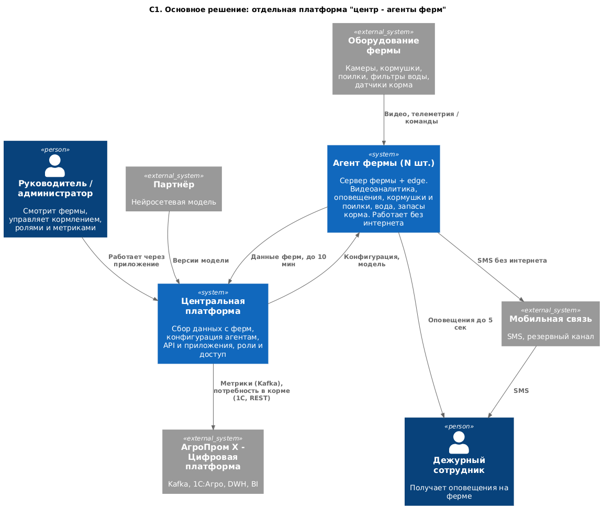
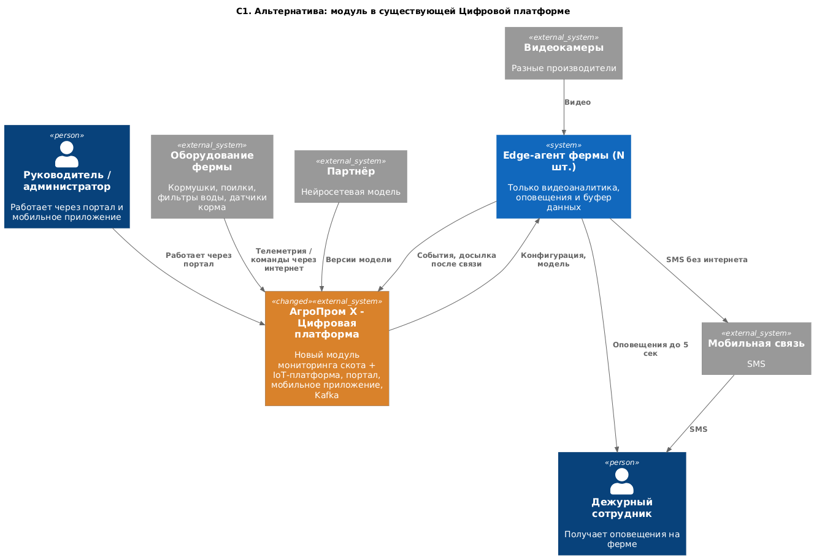

### **Название задачи:** MVP платформы мониторинга свиноферм "АгроТех Х"
### **Автор:** Ivan Busarov
### **Дата:** 28-09-2026

**Проблема**

Нужно автоматизировать кормление, безопасность и мониторинг поголовья. Готовые продукты не подходят из-за законодательства или цены, поэтому делаем MVP с нуля и запускаем на нескольких фермах.

### **Функциональные требования**

|**№**|**Действующие лица или системы**|**Use Case**|**Описание**|
| :-: | :- | :- | :- |
|UC1|Камеры, агент фермы, дежурный|Оповещение о нештатной ситуации|Агент по видео находит драку, задавливание, болезнь или гибель -> оповещает дежурного|
|UC2|Камеры, агент фермы, центр|Пересчёт поголовья|Агент считает животных -> отправляет в центр|
|UC3|Руководитель, центр, агент, кормушки и поилки|Управление кормлением|Руководитель задаёт режим -> центр передаёт агенту -> агент управляет оборудованием|
|UC4|Фильтры воды, агент, дежурный|Контроль воды|Агент следит за фильтрами -> при аварии оповещает дежурного|
|UC5|Датчики корма, агент, центр, 1С|Запасы и прогноз корма|Агент собирает остатки -> центр считает прогноз -> передаёт в 1С|
|UC6|Агент, мобильная связь, дежурный, центр|Работа без интернета|Агент работает дальше, шлёт SMS, копит данные и досылает после восстановления связи|
|UC7|Администратор, центр, агенты, Цифровая платформа|Метрики|Центр отдаёт базовые и свои метрики в другие системы; админ добавляет свои метрики|
|UC8|Пользователь, центр|Вход и роли|Пользователь входит, получает роль, работает через веб или мобильное приложение|

### **Нефункциональные требования**

|**№**|**Требование**|
| :-: | :- |
|1|Отказоустойчивость 99,95%|
|2|Расширяемость без изменения существующего|
|3|Не больше 5 секунд от нештатной ситуации до оповещения|
|4|Видеоаналитика в реальном времени (миллисекунды)|
|5|Синхронизация с центром до 10 минут, агентов без ограничения|

### **Решение**

[context_main.puml](context_main.puml)

Отдельная платформа: агенты на фермах и центральная платформа в головном офисе.

- Видеоаналитика и оповещения работают на ферме, иначе без интернета и за 5 секунд не успеть (требования 3, 4, UC6).
- Центру хватает синхронизации раз в 10 минут.
- Платформа отдельная, как решил бизнес, и не зависит от старых систем (требование 2).
- С существующим ландшафтом связь только через Цифровую платформу: метрики и данные для 1С.

### **Альтернативы**

[context_alternative.puml](context_alternative.puml)

Модуль мониторинга скота внутри существующей Цифровой платформы. На ферме только видеоаналитика, оповещения и буфер. Оборудование подключаем к IoT-платформе, интерфейс - в существующих портале и мобильном приложении.

- Плюс: меньше новой разработки.
- Минус: без интернета не работают кормление и контроль воды.
- Минус: придётся дорабатывать чужие системы.

**Недостатки, ограничения, риски**

- Основное решение дороже: больше новой разработки.
- Агент "толстый", его и модель партнёра надо обновлять на всех фермах.
- Один сервер на ферме - точка отказа для 99,95%. Разберу в задании 2.
- Нейросеть путает тень с животным и может ошибаться при трекинге - для MVP терпим.
- Нужны камеры с ночной съёмкой.
