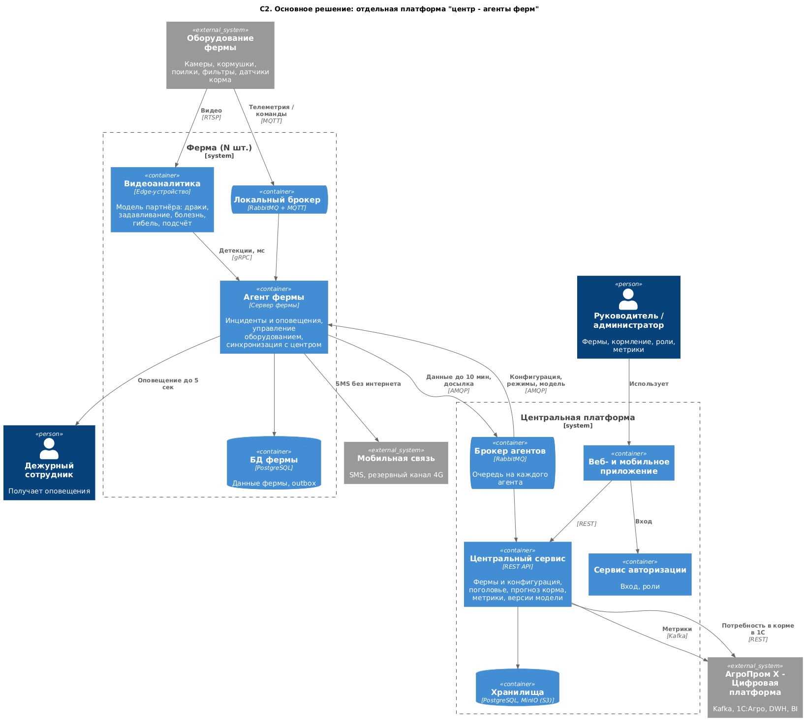
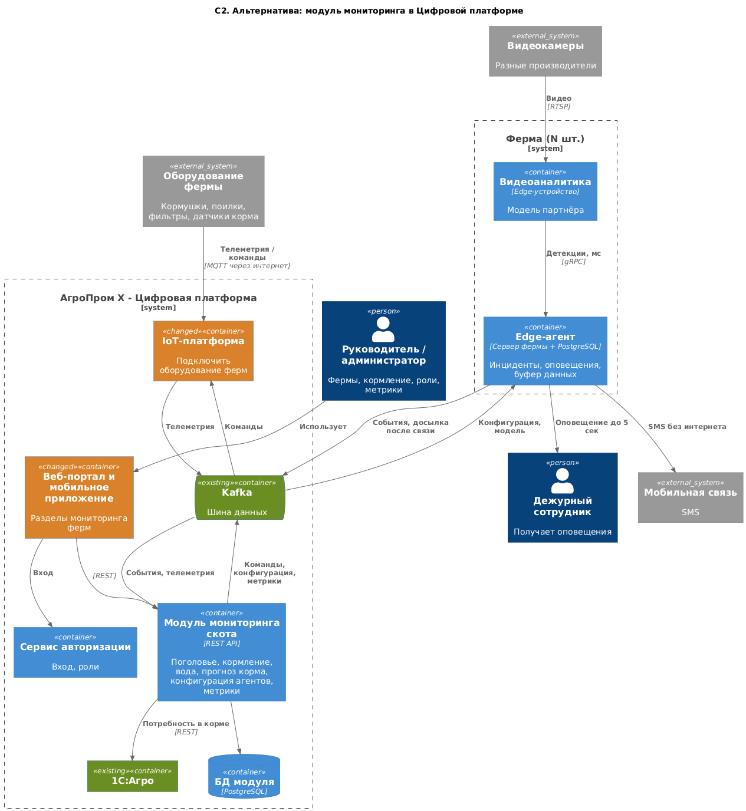

### **Название задачи:** MVP платформы мониторинга свиноферм "АгроТех Х"
### **Автор:** Ivan Busarov
### **Дата:** 28-09-2026

**Проблема**

Нужно автоматизировать кормление, безопасность и мониторинг поголовья. Готовые продукты не подходят из-за законодательства или цены, поэтому делаем MVP с нуля и запускаем на нескольких фермах.

### **Функциональные требования**

|**№**|**Действующие лица или системы**|**Use Case**|**Описание**|
| :-: | :- | :- | :- |
|UC1|Камеры, агент фермы, дежурный|Оповещение о нештатной ситуации|Агент по видео находит драку, задавливание, болезнь или гибель -> оповещает дежурного|
|UC2|Камеры, агент фермы, центр|Пересчёт поголовья|Агент считает животных -> отправляет в центр|
|UC3|Руководитель, центр, агент, кормушки и поилки|Управление кормлением|Руководитель задаёт режим -> центр передаёт агенту -> агент управляет оборудованием|
|UC4|Фильтры воды, агент, дежурный|Контроль воды|Агент следит за фильтрами -> при аварии оповещает дежурного|
|UC5|Датчики корма, агент, центр, 1С|Запасы и прогноз корма|Агент собирает остатки -> центр считает прогноз -> передаёт в 1С|
|UC6|Агент, мобильная связь, дежурный, центр|Работа без интернета|Агент работает дальше, шлёт SMS, копит данные и досылает после восстановления связи|
|UC7|Администратор, центр, агенты, Цифровая платформа|Метрики|Центр отдаёт базовые и свои метрики в другие системы; админ добавляет свои метрики|
|UC8|Пользователь, центр|Вход и роли|Пользователь входит, получает роль, работает через веб или мобильное приложение|

### **Нефункциональные требования**

|**№**|**Требование**|
| :-: | :- |
|1|Отказоустойчивость 99,95%|
|2|Расширяемость без изменения существующего|
|3|Не больше 5 секунд от нештатной ситуации до оповещения|
|4|Видеоаналитика в реальном времени (миллисекунды)|
|5|Синхронизация с центром до 10 минут, агентов без ограничения|

### **Решение**

C1 и выбор между вариантами - в [Task1/ADR.md](../Task1/ADR.md).

**Ограниченные контексты**

|**Контекст**|**За что отвечает**|**Где (основное)**|**Где (альтернатива)**|
| :- | :- | :- | :- |
|Видеоаналитика|Модель партнёра, детекции, подсчёт|Ферма|Ферма|
|Инциденты и оповещения|Правила, дежурные, SMS|Ферма|Ферма|
|Оборудование|Адаптеры производителей, кормление, вода, запасы корма|Ферма|Модуль + IoT-платформа|
|Мониторинг|Поголовье, прогноз корма, метрики|Центр|Модуль|
|Фермы|Реестр, конфигурация агентов, свои метрики, версии модели|Центр|Модуль|
|Доступ|Вход, роли|Сервис авторизации|Сервис авторизации|

На C2 близкие контексты объединены в один контейнер ("Агент фермы", "Центральный сервис"). Разбивка на компоненты - в задании 3.

**Основное решение**

[container_main.puml](container_main.puml)

|**Взаимодействие**|**Технология**|**Почему**|
| :- | :- | :- |
|Видеоаналитика -> Агент|gRPC|Нужны миллисекунды|
|Оборудование <-> Агент|RabbitMQ + MQTT|MQTT для устройств, лёгкий, хватает одного сервера фермы|
|Ферма <-> Центр|RabbitMQ, очередь на агента + outbox|Связь нестабильная: данные досылаются, команды ждут агента в очереди|
|Центр -> Цифровая платформа|Kafka (метрики), REST (1С)|Kafka уже есть в компании; 1С интегрируется через REST|
|Приложение -> Центр|REST, вход через сервис авторизации|Выбор по умолчанию для UI|

Компромиссы: два брокера - RabbitMQ для агентов и Kafka компании; при большом числе ферм RabbitMQ может не вытянуть; данные в центре отстают до 10 минут.

### **Альтернативы**

[container_alternative.puml](container_alternative.puml)

|**Взаимодействие**|**Технология**|**Почему**|
| :- | :- | :- |
|Видеоаналитика -> Edge-агент|gRPC|Как в основном|
|Оборудование -> IoT-платформа|MQTT через интернет|Переиспользуем IoT-шлюз|
|Ферма <-> Модуль, Модуль <-> IoT-платформа|Kafka|Шина уже есть, новый брокер не нужен|
|Модуль -> 1С|REST|Как в основном|
|Портал -> Модуль|REST, вход через сервис авторизации|Как в основном|

Компромиссы: команды кормушкам идут через Kafka, хотя для команд лучше очереди; меньше нового кода, но больше доработок чужих систем; Kafka придётся открыть наружу для ферм.

**Недостатки, ограничения, риски**

Основное решение:

- Один сервер на ферме - точка отказа для 99,95%. Меры: автоперезапуск, резервное питание, мониторинг агентов из центра.
- Агент и модель надо обновлять на всех фермах. Меры: обновления раздаёт центр, старая модель остаётся для отката.
- Адаптеры под каждого производителя пишем сами. Меры: в MVP ограничить список оборудования.
- Нестабильная связь. Меры: резерв 4G, outbox, идемпотентная обработка в центре.

Альтернативное решение:

- Без интернета не работают кормление и контроль воды (UC3, UC4).
- Зависим от команд IoT-платформы, портала и мобильного приложения.
- Тот же риск одного сервера фермы.
